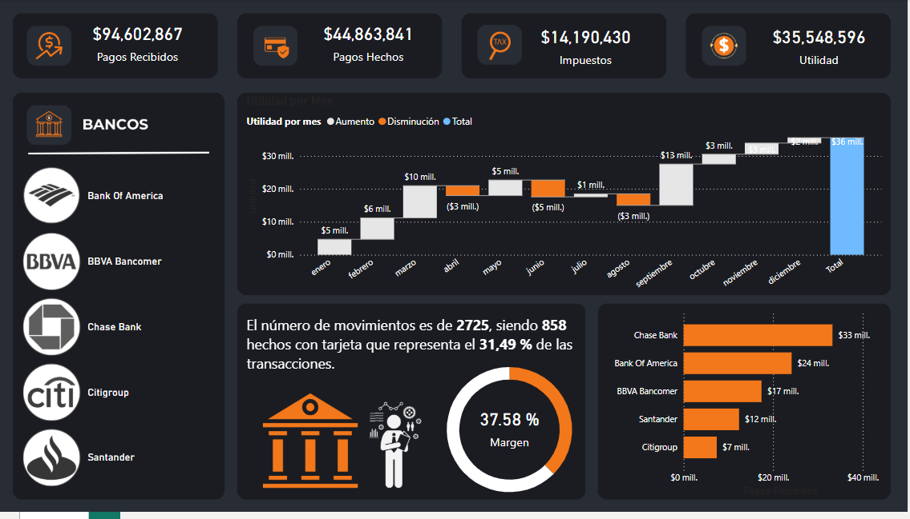
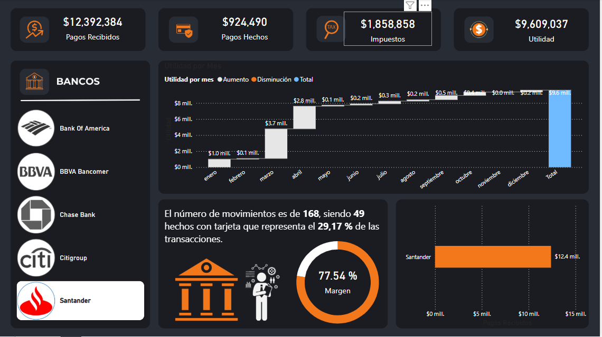

# 📊 Análisis financiero - Power BI

Este dashboard fue desarrollado como parte de un curso de análisis de datos. Utiliza Power BI para visualizar el comportamiento dde analisis financiero con diferentes productos y la visualizacion de los pagos totales, impuestos utilizando tarjetas informativas, grafica de cascada, grafico de pie, grafica de barras y un storytelling

## 🛠️ Herramientas utilizadas

- Power BI
- Excel (fuente de datos)
- DAX para cálculos
- Segmentadores y visualizaciones interactivas
- StoryTelling

## 📷 Capturas

## 📁 Archivos

- `Dashboard Financiero.pbix`: archivo del dashboard en Power BI
- `Base Financiero.xlsx`: archivo con los datos base

## ✅ Conclusiones

- Se identifico que Bancos fuewron los mas utilizados para la generacion de pagos
- El ZStoryTellling le da otra perspectiva al Dashboard y la segemntacion por imagen y se ilumine esta le da mas dinamismoo.
